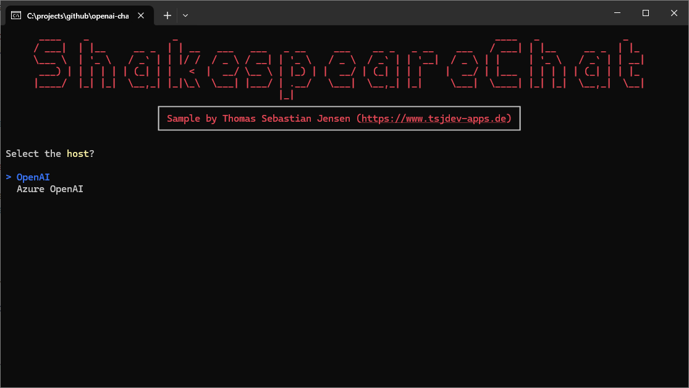
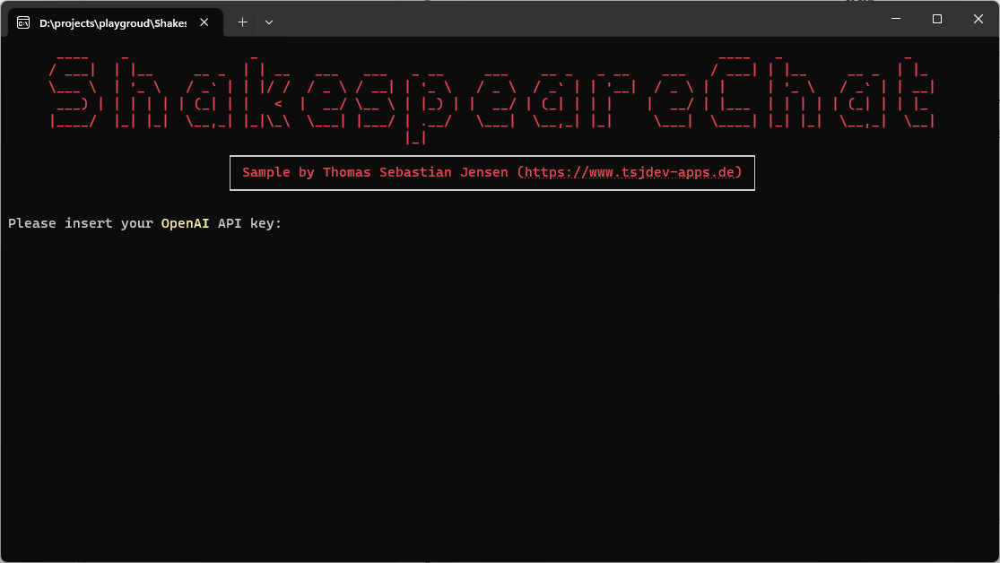
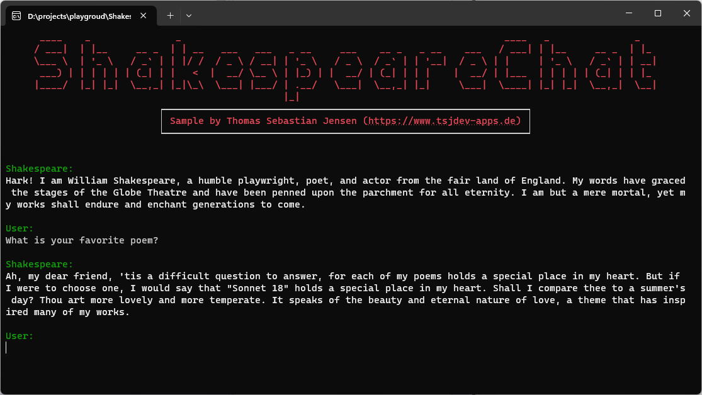

# OpenAI and Azure OpenAI Chat - Shakespeare Chat

This repository contains a simple console application written in .NET 8 to demonstrate how to use the chat functionality of [OpenAI](https://openai.com) and/or [Azure OpenAI](https://azure.microsoft.com/en-us/products/ai-services/openai-service) using the [Azure.AI.OpenAI](https://www.nuget.org/packages/Azure.AI.OpenAI/) NuGet package.

## Usage

You need to create an OpenAI account on this [website](https://platform.openai.com/docs/overview). You have to pay to use the API so make sure that you add your payment information. After that, you can create an API Key [here](https://platform.openai.com/api-keys) for further use. If you have access to an Azure OpenAI instance you can also use this instance for the demo application.

Just run the app and follow the steps displayed on the screen.

## Screenshots

Here you can see the console application in action:

First you need to select the host.

You need to enter the needed properties, like endpoints or API keys.

Finally you are able to chat with William Shakespeare.

## Blog Post

If you are more interested into details, please see the following [medium.com](https://www.medium.com) post:

- [Creating a copilot using OpenAI and/or Azure OpenAI](https://medium.com/medialesson/creating-a-copilot-using-openai-and-or-azure-openai-03938fcf7413)